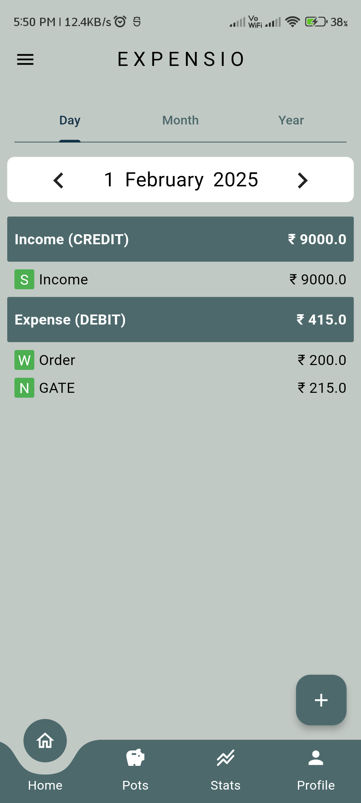
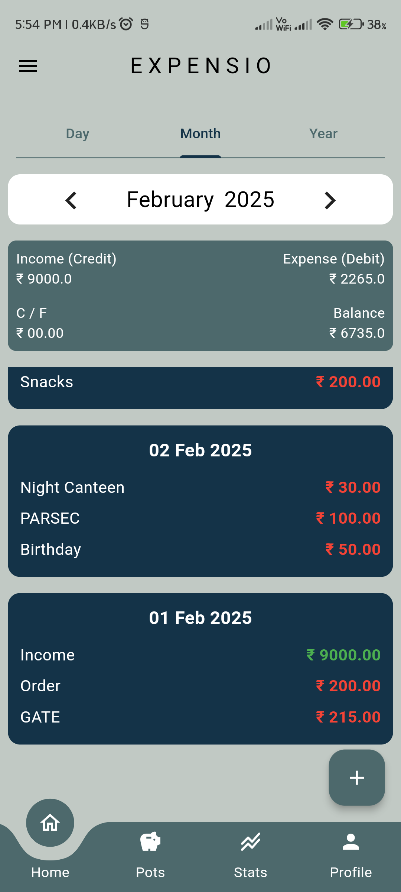
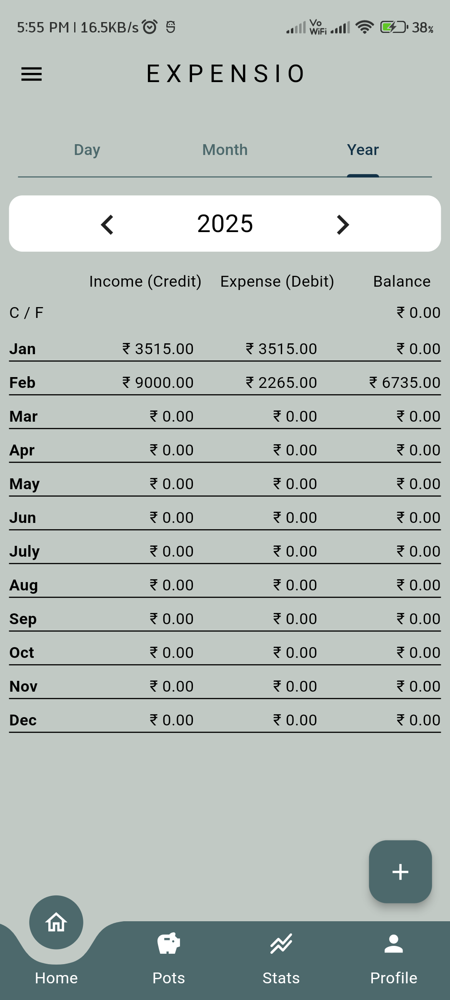
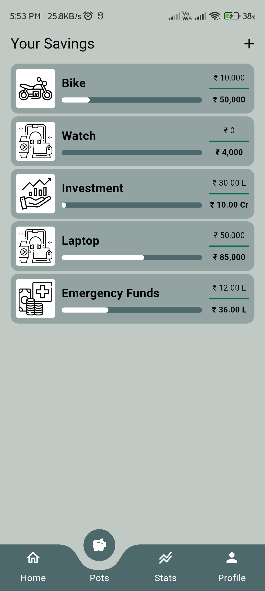
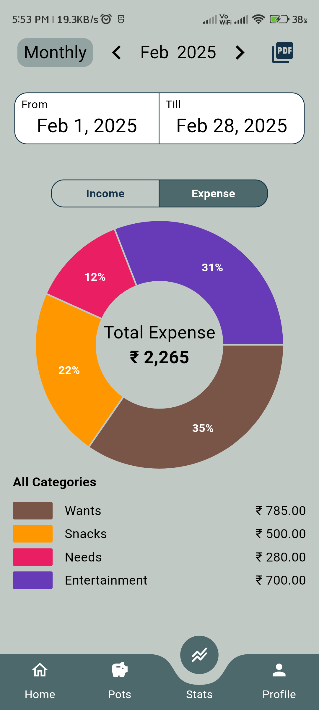
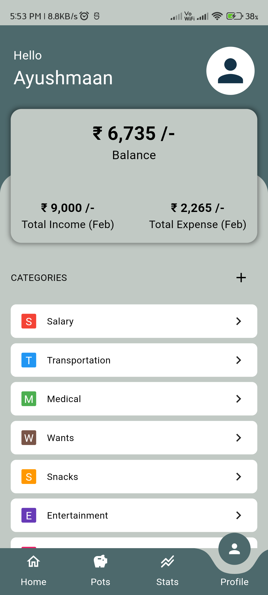

# 📊 Expensio - Track Every Rupee, Plan Every Move

Expensio is a **smart expense tracking application** built with **Flutter and Firebase**.  
It allows users to **track expenses, set savings goals, and gain financial insights** in a simple and intuitive way.  

---

## **Features**  

- **User Authentication** – Secure sign-in and account management with Firebase Authentication.  
- **Expense Tracking** – Add, edit, and delete daily, monthly, and yearly expenses.  
- **Categorization & Budgeting** – Organize spending into categories and set budgets.  
- **Savings Pots** – Save for big purchases with dedicated savings goals.  
- **Graphical Insights** – View spending trends through pie charts and reports.  
- **PDF & CSV Export** – Download detailed expense reports.  
- **Cloud Backup** – Secure and real-time data storage with Firestore.  
<!-- - **Dark Mode & Themes** – Personalize the app with different themes. -->

---

## **Tech Stack**  

- **Flutter** – Cross-platform UI framework.  
- **Firebase Authentication** – Secure login and user management.  
- **Cloud Firestore** – Real-time NoSQL database for storing transactions.  
- **Provider** – Efficient state management.  
- **Flutter Charts** – Visual representation of financial insights.  
<!-- - **Firebase Storage** – Securely store user-uploaded files. -->

---

## **Installation**  

### **1️⃣ Clone the repository:**  
```sh
git clone https://github.com/yourusername/expensio.git
cd expensio
```

### **2️⃣ Install dependencies:**  
```sh
flutter pub get
```

### **3️⃣ Set up Firebase:**  
- Create a Firebase project and enable **Authentication & Firestore**.  
- Download **`google-services.json`** (Android) and **`GoogleService-Info.plist`** (iOS).  
- Place them in the appropriate directories (`android/app/` and `ios/Runner/`).  

### **4️⃣ Run the application:**  
```sh
flutter run
```

---

## **📸 Screenshots**  

_(Add relevant screenshots here)_  

| Home Page | Monthly Overview | Yearly Overview |
|-----------|------------|-------|
|  |  |  |

| Savings Pots | Stats | Profile |
|-------------|---------|----------|
|  |  |  |

---

## **🚀 Future Enhancements**  

- **Budget Constraints** – Set an overall spending limit and category-based budgets.  
- **Recurring Transactions** – Automate bill payments and subscriptions.  
- **AI-based Insights** – Smart predictions based on spending history.  
- **Dark Mode & Themes** – Personalize the app with multiple themes.  
- **Bank Integration** – Auto-fetch transactions for easier tracking.  
<!-- - **Multi-Currency Support** – Track expenses in different currencies. -->

---

## **👨‍💻 Contribution**  

Contributions are welcome!  
Feel free to **fork** this repository, work on improvements, and submit a **pull request**.  

---

## **📬 Contact**  

📩 **Developer:** Naga Ayushmaan Betapudi  
📧 **Email:** [ayushmaanbn@gmail.com](mailto:ayushmaanbn@gmail.com)  

---

_Developed with ❤️ using Flutter & Firebase._ 🚀  

